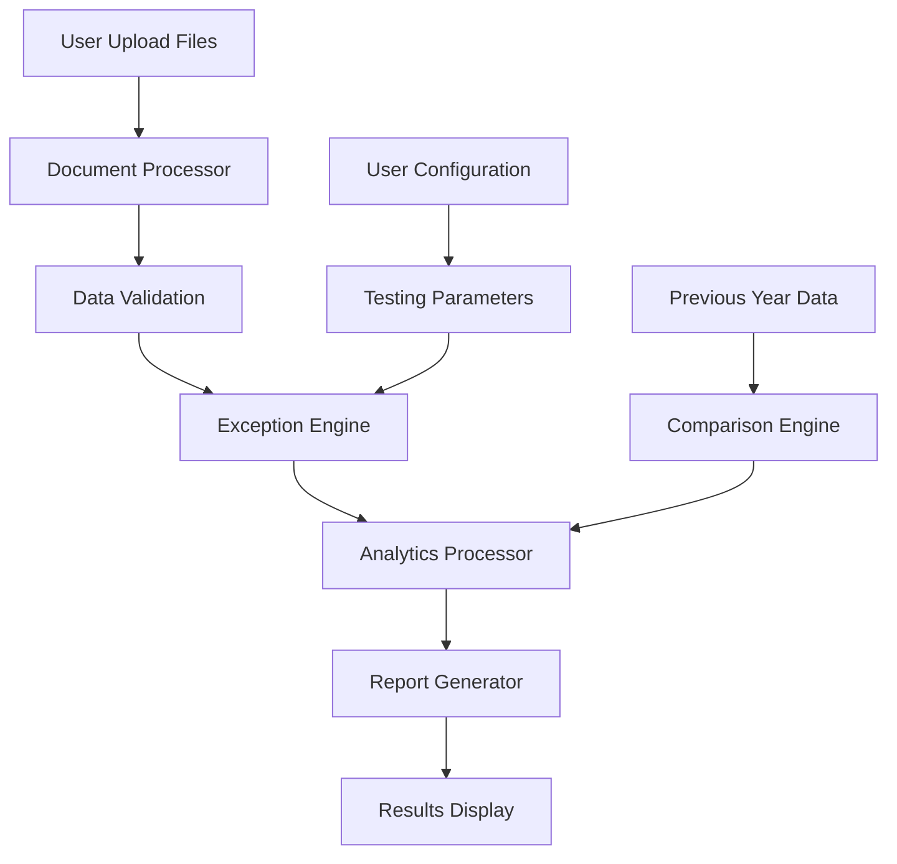

# Payroll Module Implementation Plan

## Overview

This document outlines the comprehensive implementation plan for the Payroll Module within the existing accounting desktop application. The module focuses on "Employee Benefit Expenses" and follows the established pattern of Tailoring Questions, ROMMs (Risk of Material Misstatement), Controls, and Substantive Procedures.

## Table of Contents

- [Project Structure](#project-structure)
- [Technical Architecture](#technical-architecture)
- [Component Implementation Plan](#component-implementation-plan)
- [Data Processing Requirements](#data-processing-requirements)
- [Testing Framework](#testing-framework)
- [UI/UX Implementation](#uiux-implementation)
- [File Processing Engine](#file-processing-engine)
- [Analytics and Reporting](#analytics-and-reporting)
- [Integration Points](#integration-points)
- [Development Timeline](#development-timeline)
- [Risk Assessment](#risk-assessment)

## Project Structure

### File Organization

```
src/
├── components/
│   └── payroll/
│       ├── PayrollDashboard.tsx
│       ├── TailoringQuestions.tsx
│       ├── RiskAssessment.tsx
│       ├── Controls.tsx
│       ├── SubstantiveProcedures.tsx
│       ├── ipe-testing/
│       │   ├── IPETestingPage.tsx
│       │   ├── DocumentUploader.tsx
│       │   ├── PayrollRegisterProcessor.tsx
│       │   ├── CTCMasterProcessor.tsx
│       │   └── EmployeeDataProcessor.tsx
│       ├── exceptions/
│       │   ├── ExceptionTesting.tsx
│       │   ├── ExceptionConfigPanel.tsx
│       │   ├── ExceptionResults.tsx
│       │   └── ExceptionReportGenerator.tsx
│       ├── headcount/
│       │   ├── HeadcountReconciliation.tsx
│       │   ├── HeadcountAnalytics.tsx
│       │   └── WeightedAverageCalculator.tsx
│       ├── analytical/
│       │   ├── AnalyticalProcedures.tsx
│       │   ├── MoMAnalysis.tsx
│       │   ├── IncrementAnalysis.tsx
│       │   ├── SalaryAnalytical.tsx
│       │   └── PFAnalytical.tsx
│       ├── actuary/
│       │   ├── ActuaryTesting.tsx
│       │   ├── DataComparison.tsx
│       │   └── ActuaryReports.tsx
│       └── managerial/
│           ├── ManagerialRemuneration.tsx
│           ├── Section197Compliance.tsx
│           └── EffectiveCapitalCalculator.tsx
├── data/
│   └── payroll/
│       ├── PayrollConstants.ts
│       ├── ExceptionRules.ts
│       ├── ComplianceRules.ts
│       └── CalculationFormulas.ts
├── helpers/
│   └── payroll/
│       ├── ExcelProcessor.ts
│       ├── PayrollCalculations.ts
│       ├── ExceptionEngine.ts
│       ├── DataValidator.ts
│       └── ReportGenerator.ts
├── types/
│   └── payroll/
│       ├── PayrollTypes.ts
│       ├── ExceptionTypes.ts
│       ├── AnalyticsTypes.ts
│       └── ComplianceTypes.ts
└── constants/
    └── PayrollMapping.ts
```

## Technical Architecture

### Core Technologies

- **Frontend**: React 19.1.0 with TypeScript
- **Styling**: Tailwind CSS with shadcn/ui components
- **File Processing**: Custom Excel/CSV processor using existing document infrastructure
- **Data Validation**: Zod for schema validation
- **Charts**: Recharts for analytics visualization
- **State Management**: React state with Context API
- **IPC**: Electron IPC for file operations

### Data Flow Architecture



## Component Implementation Plan

### 1. Tailoring Questions Component

**File**: `src/components/payroll/TailoringQuestions.tsx`

**Features**:

- Dynamic question rendering based on JSON configuration
- Conditional logic for follow-up questions
- Integration with existing question framework from planning module

**Implementation**:

```typescript
interface TailoringQuestion {
  id: string;
  question: string;
  type: "yes_no" | "text" | "conditional";
  followUp?: TailoringQuestion[];
  required: boolean;
}

const payrollQuestions: TailoringQuestion[] = [
  {
    id: "accounting_estimates",
    question:
      "Does the entity have any accounting estimates relating to payroll? (for eg. gratuity, other employee benefits, etc.)",
    type: "yes_no",
    required: true,
    followUp: [
      {
        id: "expert_estimates",
        question: "Does the management use an expert for these estimates?",
        type: "yes_no",
        required: true,
      },
    ],
  },
  {
    id: "capitalized_salary",
    question:
      "Has the entity capitalized any portion of its salary for ongoing/completed projects?",
    type: "yes_no",
    required: true,
  },
];
```

### 2. Risk Assessment (ROMMs) Component

**File**: `src/components/payroll/RiskAssessment.tsx`

**Features**:

- Pre-defined risk categories for payroll
- Risk rating system (Low/Medium/High)
- Control linking functionality

**ROMM Categories**:

1. Occurrence - Payroll expenses recorded that did not occur
2. Completeness - Payroll expenses are incomplete
3. Cutoff - Payroll expenses recorded in incorrect period
4. Accuracy - Payroll expenses not recorded at proper amount
5. Classification - Payroll expenses not recorded in proper account

### 3. IPE Testing Module

**File**: `src/components/payroll/ipe-testing/IPETestingPage.tsx`

**Document Upload Options**:

- Payroll Register (consolidated or individual monthly files)
- CTC Master (Current Year + Previous Year for initial audits)
- Additions Listing (employee hires during the year)
- Deletions Listing (employee departures during the year)
- Employee Cost Dump (with Tally integration option)

**File Processing Requirements**:

```typescript
interface PayrollRegister {
  employeeCode: string;
  employeeName: string;
  month: string;
  designation: string;
  dateOfJoining: Date;
  dateOfLeaving?: Date;
  pan?: string;
  grossPay: number;
  netPay: number;
  totalDeductions: number;
  providentFund: number;
  esi: number;
}

interface CTCMaster {
  employeeCode: string;
  employeeName: string;
  designation: string;
  basicSalary: number;
  allowances: number;
  totalCTC: number;
  dateOfJoining: Date;
}
```

### 4. Exception Testing Engine

**File**: `src/components/payroll/exceptions/ExceptionTesting.tsx`

**15 Exception Rules Implementation**:

1. **Employee Code Validation**: One employee code = one employee name
2. **Month Duplication**: No duplicate months for same employee
3. **Designation Consistency**: Max 2 designations per employee
4. **Post-Resignation Payments**: No payments after resignation date
5. **Pre-Joining Payments**: No payments before joining date
6. **PAN Uniqueness**: Unique PAN per employee
7. **Blank Designation Check**: No empty designations
8. **Gross vs Net Pay**: Gross pay ≥ Net pay
9. **Employee Code Requirement**: All employees must have codes
10. **Deduction Calculation**: Gross - Deductions = Net
11. **Negative Pay Check**: No negative net pay
12. **PF Consistency**: Consistent PF deduction patterns
13. **ESI Consistency**: Consistent ESI deduction patterns
14. **Joining Date Consistency**: Same joining date across months
15. **Leaving Date Consistency**: Consistent leaving dates

**Exception Processing Flow**:

```typescript
class ExceptionEngine {
  async runExceptions(
    data: PayrollRegister[],
    selectedExceptions: number[],
  ): Promise<ExceptionResult[]> {
    const results: ExceptionResult[] = [];

    for (const exceptionId of selectedExceptions) {
      const rule = EXCEPTION_RULES[exceptionId];
      const violations = await rule.execute(data);
      results.push({
        exceptionId,
        description: rule.description,
        violationCount: violations.length,
        violations,
      });
    }

    return results;
  }
}
```

### 5. Headcount Reconciliation

**File**: `src/components/payroll/headcount/HeadcountReconciliation.tsx`

**Features**:

- Monthly headcount tracking
- Weighted average calculations (quarterly and annual)
- Reconciliation with CTC reports
- Interactive graphs using Recharts

**Calculations**:

- **Quarterly Weighted Average**: `(Apr*3 + May*2 + Jun*1) / 6`
- **Annual Weighted Average**: `Sum(Month*Weight) / 78` (where weights are 12 to 1)

### 6. Analytical Procedures

**File**: `src/components/payroll/analytical/AnalyticalProcedures.tsx`

**Sub-modules**:

#### MoM Analysis

- Month-over-Month trend analysis per employee
- Increment period handling
- Automated remarks for joiners/leavers

#### Increment Analysis

- Pre and post-increment CTC comparison
- Percentage increase calculations
- Trend visualization with headcount correlation

#### Salary Analytical

- Expectation vs. actual expense comparison
- Risk-based threshold calculations
- Control reliance assessment

#### PF Analytical

- Provident Fund expense validation
- Percentage-based expectation setting
- Threshold compliance checking

### 7. Actuary Testing Module

**File**: `src/components/payroll/actuary/ActuaryTesting.tsx`

**Features**:

- Data completeness verification
- AI-powered accuracy comparison
- Expert evaluation documentation
- Column mapping interface

**AI Comparison Engine**:

```typescript
interface DataComparison {
  employeeCode: string;
  field: string;
  actuaryValue: any;
  ctcValue: any;
  difference: any;
  status: "match" | "mismatch" | "missing";
}

class ActuaryComparison {
  async compareDatasets(
    actuaryData: any[],
    ctcData: any[],
    mappings: ColumnMapping[],
  ): Promise<DataComparison[]> {
    // AI-powered comparison logic
    // Handle different column structures
    // Generate detailed comparison reports
  }
}
```

### 8. Managerial Remuneration

**File**: `src/components/payroll/managerial/ManagerialRemuneration.tsx`

**Features**:

- Section 197 compliance checking
- Profit calculation as per Section 198
- Effective capital computation
- Automatic limit calculations based on company type

**Calculation Engine**:

```typescript
interface Section197Calculation {
  profitBeforeTax: number;
  adjustments: ProfitAdjustment[];
  netProfit: number;
  directorDetails: DirectorRemuneration[];
  complianceStatus: "compliant" | "non_compliant";
  limits: RemunerationLimits;
}
```

## Data Processing Requirements

### Excel File Processing

**File**: `src/helpers/payroll/ExcelProcessor.ts`

**Capabilities**:

- Multiple file format support (Excel, CSV)
- Dynamic column mapping
- Data type validation
- Large file handling with progress tracking
- Error reporting and data cleanup

### File Consolidation

- Monthly payroll register consolidation
- Automatic month identification from filenames
- Data standardization across different formats

### Data Validation Framework

**File**: `src/helpers/payroll/DataValidator.ts`

```typescript
const payrollSchema = z.object({
  employeeCode: z.string().min(1),
  employeeName: z.string().min(1),
  month: z.string().regex(/^\d{4}-\d{2}$/),
  grossPay: z.number().min(0),
  netPay: z.number().min(0),
  // ... other fields
});

class DataValidator {
  validatePayrollData(data: unknown[]): ValidationResult {
    // Comprehensive validation logic
    // Error aggregation
    // Data cleaning suggestions
  }
}
```

## Testing Framework

### Unit Tests

- Exception rule testing
- Calculation accuracy testing
- Data validation testing
- Component rendering testing

### Integration Tests

- File processing workflows
- End-to-end exception testing
- Report generation testing

### Test Files Structure

```
src/tests/
├── payroll/
│   ├── exceptions/
│   │   ├── exception-rules.test.ts
│   │   └── exception-engine.test.ts
│   ├── calculations/
│   │   ├── headcount.test.ts
│   │   ├── analytical.test.ts
│   │   └── compliance.test.ts
│   └── components/
│       ├── IPETestingPage.test.tsx
│       └── ExceptionTesting.test.tsx
```

## UI/UX Implementation

### Design System

- Consistent with existing application design
- shadcn/ui components for forms and tables
- Responsive design for various screen sizes
- Dark/light theme support (existing theme system)

### Navigation Structure

```
Payroll Module
├── Dashboard (Overview)
├── Tailoring Questions
├── Risk Assessment (ROMMs)
├── Controls
└── Substantive Procedures
    ├── IPE Testing
    ├── Exception Testing
    ├── Headcount Reconciliation
    ├── Analytical Procedures
    ├── Actuary Testing
    └── Managerial Remuneration
```

### Interactive Components

- Progress indicators for file processing
- Real-time validation feedback
- Interactive charts and graphs
- Expandable data tables
- Export functionality for reports

## File Processing Engine

### Supported Formats

- Excel (.xlsx, .xls)
- CSV files
- Tally data dumps (specific format)

### Processing Pipeline

1. **File Upload** → Document management system
2. **Format Detection** → Automatic format identification
3. **Data Extraction** → Column mapping and data parsing
4. **Validation** → Schema validation and error reporting
5. **Transformation** → Data standardization and cleanup
6. **Storage** → Temporary storage for processing
7. **Analysis** → Exception testing and calculations

### Error Handling

- Comprehensive error logging
- User-friendly error messages
- Data recovery suggestions
- Partial processing support

## Analytics and Reporting

### Chart Types (using Recharts)

- Line charts for trend analysis
- Bar charts for comparative data
- Pie charts for composition analysis
- Scatter plots for correlation analysis

### Report Generation

- Excel export functionality
- PDF report generation
- Customizable report templates
- Automated summary generation

### Real-time Analytics

- Progress tracking during processing
- Live update of calculations
- Interactive data exploration

## Integration Points

### Existing System Integration

- Document management system (existing)
- Theme system integration
- Navigation system integration
- IPC channel utilization

### External Integrations

- Tally software integration
- Excel file compatibility
- PDF generation libraries

### Data Exchange

- Import/export capabilities
- API endpoints for future integrations
- Data backup and restore functionality

## Development Timeline

### Phase 1: Foundation (Weeks 1-3)

- [ ] Project structure setup
- [ ] Basic component scaffolding
- [ ] File processing engine
- [ ] Data validation framework

### Phase 2: Core Features (Weeks 4-7)

- [ ] Tailoring questions implementation
- [ ] ROMM assessment module
- [ ] IPE testing functionality
- [ ] Exception testing engine

### Phase 3: Analytics (Weeks 8-11)

- [ ] Headcount reconciliation
- [ ] Analytical procedures
- [ ] Chart implementations
- [ ] Report generation

### Phase 4: Advanced Features (Weeks 12-15)

- [ ] Actuary testing module
- [ ] Managerial remuneration
- [ ] AI comparison engine
- [ ] Advanced analytics

### Phase 5: Testing & Polish (Weeks 16-18)

- [ ] Comprehensive testing
- [ ] Performance optimization
- [ ] UI/UX refinements
- [ ] Documentation completion

## Risk Assessment

### Technical Risks

- **Large file processing**: Implement chunked processing and progress tracking
- **Complex calculations**: Extensive testing and validation
- **Excel compatibility**: Support for multiple Excel versions and formats
- **Performance**: Optimize for large datasets

### Data Risks

- **Data accuracy**: Comprehensive validation and error checking
- **Data loss**: Backup and recovery mechanisms
- **Privacy**: Secure handling of employee data

### Implementation Risks

- **Scope creep**: Well-defined requirements and change management
- **Integration issues**: Thorough testing with existing systems
- **User adoption**: Intuitive UI and comprehensive documentation

## Success Metrics

### Functional Metrics

- 100% of specified exception rules implemented
- Sub-second response time for standard datasets
- 99.9% calculation accuracy
- Support for files up to 100MB

### User Experience Metrics

- Intuitive navigation (max 3 clicks to any feature)
- Clear error messages and guidance
- Comprehensive help documentation
- Mobile-responsive design

### Technical Metrics

- Test coverage >90%
- Zero memory leaks
- Graceful error handling
- Scalable architecture

## Conclusion

This implementation plan provides a comprehensive roadmap for developing the Payroll module within the existing accounting desktop application. The modular approach ensures maintainability, while the extensive feature set covers all requirements specified in the original document.

The phased development approach allows for incremental delivery and testing, reducing overall project risk. Integration with existing systems ensures consistency and leverages current infrastructure investments.

Success depends on careful attention to data accuracy, user experience, and system performance. Regular testing and validation throughout the development process will ensure a robust and reliable payroll auditing solution.

---

_This document serves as a living blueprint for the payroll module implementation and should be updated as requirements evolve and implementation progresses._
